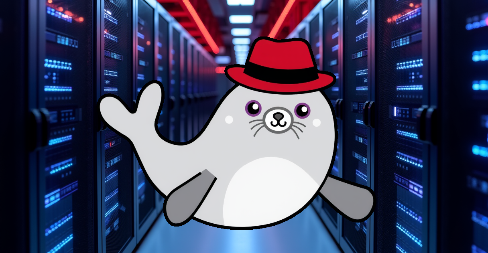
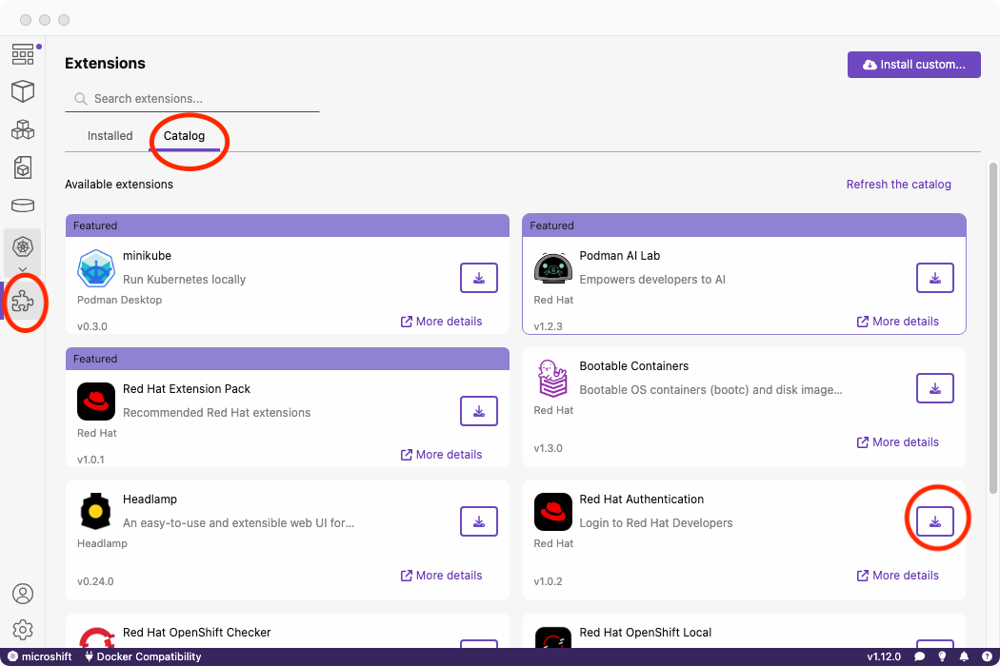
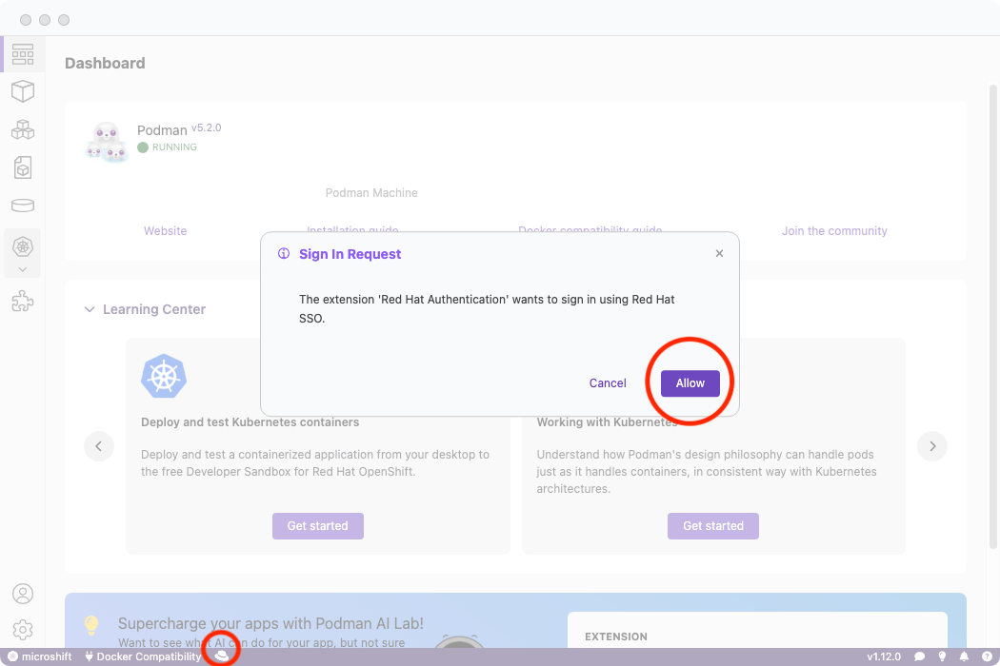
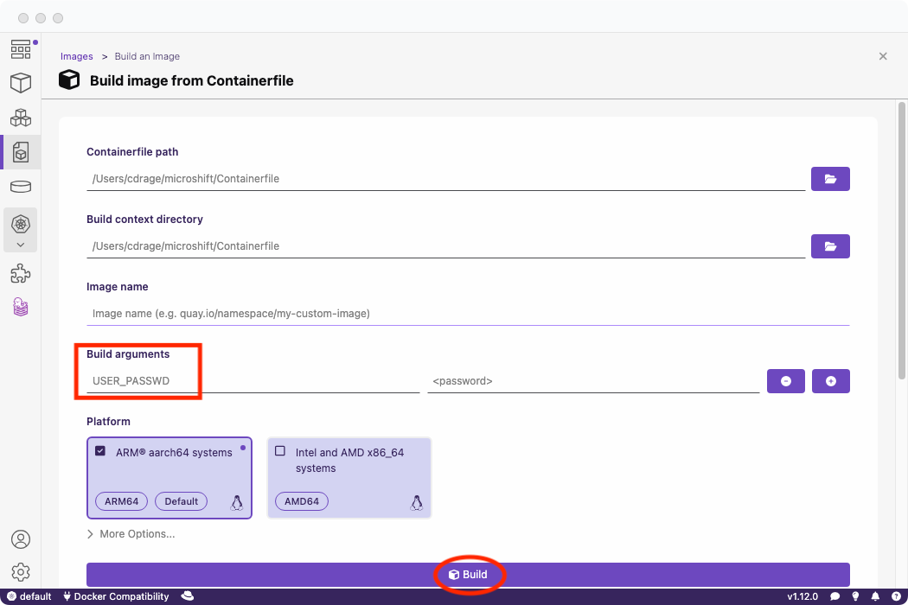
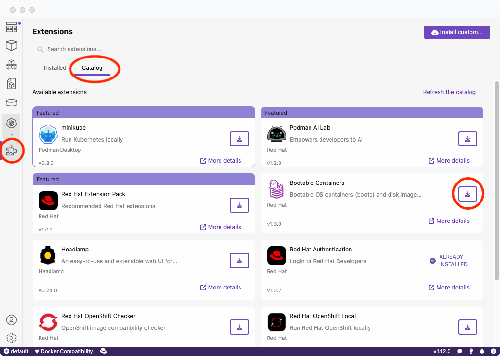
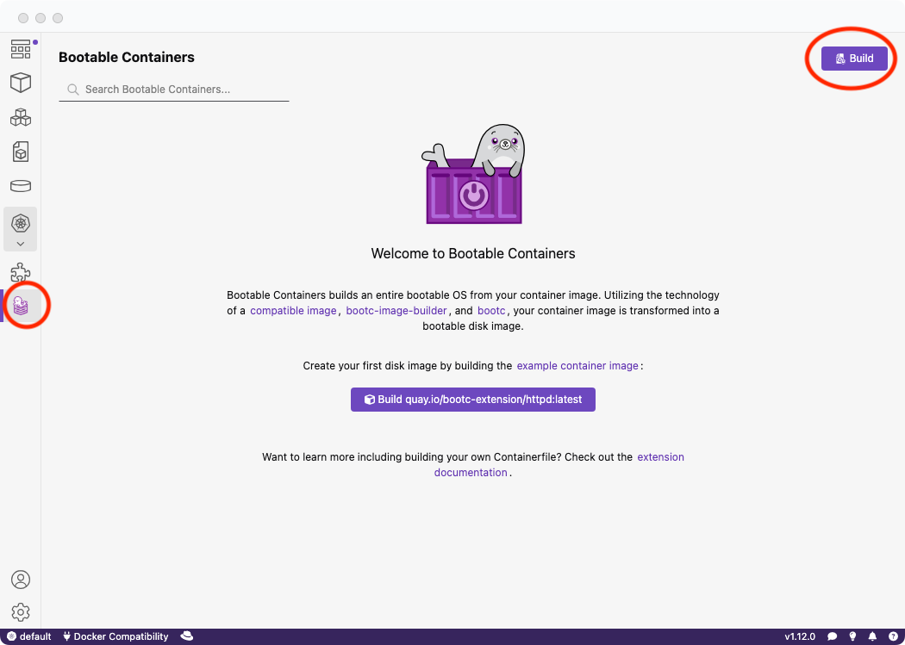
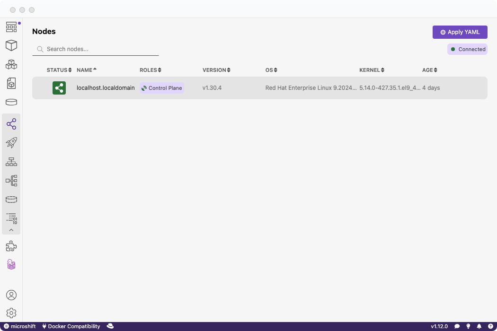

import Tabs from '@theme/Tabs';
import TabItem from '@theme/TabItem';



If you're unfamiliar with [Image Mode for RHEL](https://developers.redhat.com/products/rhel-image-mode/overview), it offers an impressive method for deploying applications directly to bare metal from either a single Containerfile or a pre-existing bootc-supported image.

A "bootable" image, known as a BootC container image, allows you to use a simple container image to create a full bootable operating system, whether it's a `raw` virtual machine image or an `iso` for USB installation!

This capability is ideal for a variety of uses, from a simple HTTP server to an OS powering a full-stack application.

In this tutorial, we'll deploy an OpenShift derivative called [MicroShift](https://www.redhat.com/en/topics/edge-computing/microshift), an edge-optimized version of OpenShift designed for single-node setups. Think of it as a compact version of OpenShift!

This entire process is carried out using a single Containerfile (or Dockerfile).

## Requirements

Before starting the tutorial, ensure you have:

- An active [Red Hat account](https://developers.redhat.com/articles/2024/05/07/podman-desktop-red-hat-developer-subscription)
- Access to an [OpenShift Hybrid Cloud pull secret](https://console.redhat.com/openshift/install/pull-secret)
- [Podman Desktop installed](https://podman-desktop.io/downloads)
- [Podman Desktop BootC Extension](https://github.com/containers/podman-desktop-extension-bootc)
- Your preferred VM-running software (e.g., [using libvirt](https://docs.redhat.com/en/documentation/red_hat_enterprise_linux/9/html/configuring_and_managing_virtualization/introducing-virtualization-in-rhel_configuring-and-managing-virtualization#what-is-virtualization_introducing-virtualization-in-rhel)

## Building the BootC container image

First, we'll build the initial BootC container image from which we'll later create a bootable OS.

### Logging into Red Hat registry

Before proceeding, download the Red Hat Authentication extension from the catalog to enable access to Red Hat registries:



Then log into your account:



### Download your OpenShift Hybrid Cloud pull secret

Download your [pull secret](https://console.redhat.com/openshift/install/pull-secret).

This is downloaded as `pull-secret.txt`. Put it in a secure location.

### Creating the Containerfile (or Dockerfile)

The Containerfile is crucial for creating the bootable image.

It's important to note that we will be providing _one_ argument during the build and that is the **PASSWORD** in order to access the Virtual Machine that will be logged in via the `redhat` username.

We will be using the Containerfile from the [official MicroShift image mode documentation](https://github.com/openshift/microshift/blob/main/docs/contributor/image_mode.md#build-image).

Copy the Containerfile from the above link to a new file which we will be building with Podman Desktop:

```sh
$ curl https://raw.githubusercontent.com/openshift/microshift/main/docs/config/Containerfile.bootc-rhel9 -o Containerfile
```

### Build with Podman Desktop

Select the Containerfile and build it within Podman Desktop.

You will need to provide:

- A password for the `redhat` user that will be created in the Containerfile.

Pass the argument as `USER_PASSWD` in the build page arguments.



## Build the bootable image with BootC Podman Desktop extension

### Install

Install the BootC Podman Desktop extension from the extensions catalog:



### Build the image

Now, create the bootable image from our container image!

Click the new BootC icon on the navigation bar and go to build:



Once the build is complete, you'll see a confirmation on the dashboard.

Next, select the image we built and choose an appropriate output format for testing the bootable image. **RAW** is a common choice for local testing with QEMU and other VM software like `libvirt`.

## Testing the image

Explore various ways to test your image, using local software or cloud platforms. Here are some common steps for using the **RAW** output bootable image.

### Running the Virtual Machine

This guide doesn't cover all methods for running a virtual machine, but here are the most common:

<Tabs>
   <TabItem value="win" label="Windows (.vhd)" className="markdown">

When using Hyper-V, create a `.vhd` image with BootC:

1.  When building, select the `.vhd` option.
2.  [Install Hyper-V](https://learn.microsoft.com/en-us/virtualization/hyper-v-on-windows/quick-start/enable-hyper-v)
3.  [Import the virtual machine](https://learn.microsoft.com/en-us/windows-server/virtualization/hyper-v/deploy/export-and-import-virtual-machines)

</TabItem>
   <TabItem value="macOS" label="macOS Silicon (.raw)" className="markdown">

1. When building, select the `.raw` option and ARM64 architecture.

2. Install QEMU:

```sh
$ brew install qemu
```

3. Navigate to the directory containing your `disk.raw` file:

```sh
$ cd ~/output
```

4. Run the `qemu` command:

```sh
$  qemu-system-aarch64 \
    -m 8G \
    -M virt \
    -accel hvf \
    -cpu host \
    -smp 4 \
    -serial mon:stdio \
    -nographic \
    -netdev user,id=mynet0,hostfwd=tcp::2222-:22 \
    -device e1000,netdev=mynet0 \
    -drive file=/opt/homebrew/share/qemu/edk2-aarch64-code.fd,format=raw,if=pflash,readonly=on \
    -drive file=disk.raw,if=virtio,cache=writethrough,format=raw
```

4. Verify the connection:

With the above `qemu` command, a port has now been opened locally at :2222 to SSH forward to the bootable image. You can now access your virtual machine by doing the following:

```sh
$ ssh redhat@localhost -p 2222
```

</TabItem>
   <TabItem value="linux" label="Linux (.raw)" className="markdown">

1. When building, select the `.raw` option and AMD64 architecture.

2. [Install QEMU](https://www.qemu.org/download/#linux).

3. Navigate to the directory containing your `disk.raw` file:

```sh
$ cd ~/output
```

4. Run the `qemu` command:

```sh
$ qemu-system-x86_64 \
    -m 8G \
    -cpu Broadwell-v4 \
    -nographic \
    -netdev user,id=mynet0,hostfwd=tcp::2222-:22 \
    -device e1000,netdev=mynet0 \
    -snapshot disk.raw
```

4. Verify the connection:

With the above `qemu` command, a port has now been opened locally at :2222 to SSH forward to the bootable image. You can now access your virtual machine by doing the following:

```sh
$ ssh redhat@localhost -p 2222
```

</TabItem>
</Tabs>

## Configuring and verifying MicroShift

After you boot your virtual machine, you can now configure MicroShift as well as verify the connection.

### Copying over the OpenShift pull secret

Before proceeding with verifying OpenShift, the OpenShift pull secret must be copied over so that MicroShift can download Red Hat registry-authenticated container images.

Below we will copy the OpenShift secret you had previously downloaded to the virtual machine.

1. Download your [OpenShift pull secret](https://console.redhat.com/openshift/install/pull-secret) which is downloaded as `pull-secret.txt`

2. Use `scp` to copy over to the virtual machine:

```sh
$ scp -P 2222 pull-secret.txt redhat@localhost:~/
```

3. SSH into the VM:

```sh
$ ssh redhat@localhost -p 2222
```

4. Move the secret to `/etc/crio/openshift-pull-secret`:

```sh
$ sudo mv pull-secret.txt /etc/crio/openshift-pull-secret
```

5. Restart the `microshift` service:

```sh
$ sudo systemctl restart microshift
```

### Listing pods

Below we will SSH into the virtual machine and confirm that MicroShift is deploying Pods correctly:

1. SSH into the VM:

```sh
$ ssh redhat@localhost -p 2222
```

2. Copy the generated `kubeconfig` file to `~/.kube/config`:

```sh
$ mkdir -p ~/.kube
$ sudo cp /var/lib/microshift/resources/kubeadmin/kubeconfig ~/.kube/config
$ sudo chown redhat ~/.kube/config
```

3. Verify Pods are running by using `oc` or `kubectl`:

```sh
$ kubectl get pods -A
NAMESPACE                  NAME                                       READY   STATUS    RESTARTS   AGE
kube-system                csi-snapshot-controller-856bb8b9bc-9n7lj   1/1     Running   1          3d23h
kube-system                csi-snapshot-webhook-7c64d4d4d7-98v6l      1/1     Running   1          3d23h
openshift-dns              dns-default-n2td4                          2/2     Running   2          3d23h
openshift-dns              node-resolver-7cslg                        1/1     Running   1          3d23h
openshift-ingress          router-default-7cbc67954b-nqqc6            1/1     Running   1          3d23h
openshift-ovn-kubernetes   ovnkube-master-zcqw5                       4/4     Running   5          3d23h
openshift-ovn-kubernetes   ovnkube-node-crnn9                         1/1     Running   2          3d23h
openshift-service-ca       service-ca-6799f567-k7lsc                  1/1     Running   1          3d23h
```

### Using Podman Desktop to verify MicroShift

Alternatively, you can copy the MicroShift configuration file to your local machine and test it remotely on Podman Desktop.

1. On your local machine, create the `.kube` directory if it does not exist already:

```sh
$ mkdir ~/.kube
```

2. Copy the remote `kubeconfig` file to a local configuration file:

Within MicroShift, a `kubeconfig` file is automatically created at `/var/lib/microshift/resources/kubeadmin/kubeconfig`.

Copy the file over to your local `.kube/config`

```sh
scp -P 2222 redhat@localhost:/var/lib/microshift/resources/kubeadmin/kubeconfig ~/.kube/config
```

3. Use Podman Desktop to verify the MicroShift cluster:

Podman Desktop will automatically detect your `.kube/config` file.

Note: You may need to modify your `.kube/config` file to reflect the correct domain or IP address of your cluster.



## Conclusion

This tutorial provided a step-by-step guide on deploying a bootable MicroShift image using Podman Desktop and the BootC extension. By leveraging tools such as BootC and Podman, we've streamlined the process of creating a lightweight, yet fully functional, OpenShift environment suitable for single-node edge computing scenarios.

Thank you for following along, and happy deploying!
