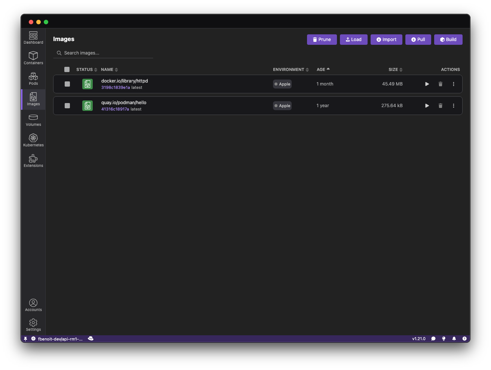
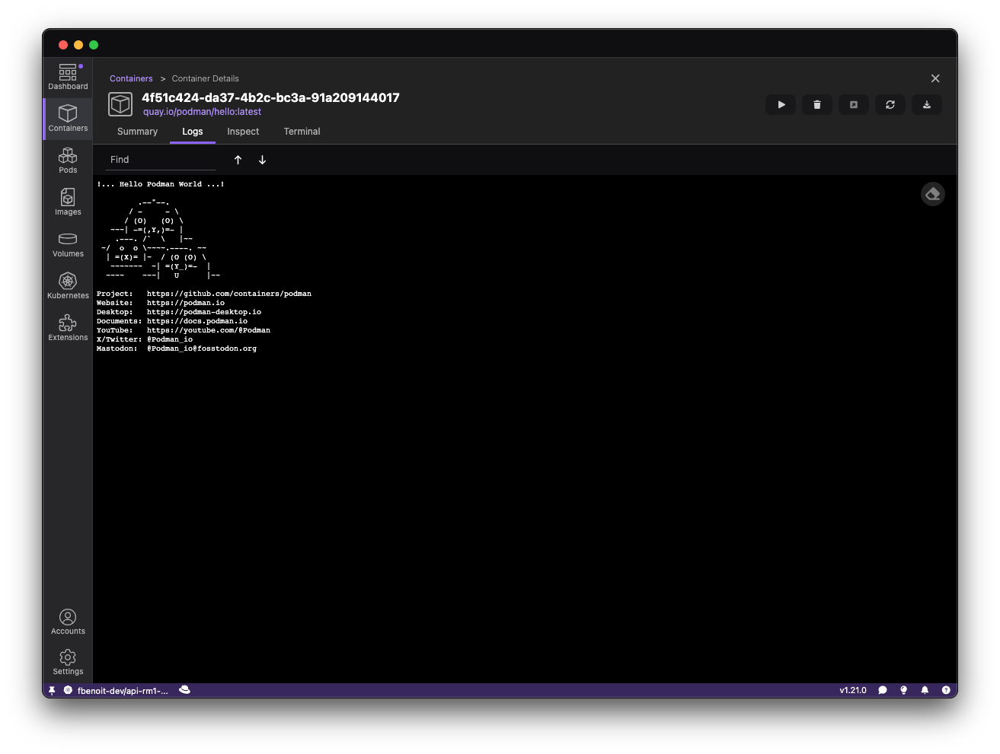

Apple Silicon macOS users now have a new way to manage containers locally using the [Apple Container](https://github.com/apple/container) project. This tool creates and runs Linux containers inside lightweight virtual machines optimized for Apple silicon, and it's fully written in Swift.

With the new **[Podman Desktop Apple Container extension](https://github.com/podman-desktop/extension-apple-container)** for Podman Desktop, you can now display your containers, images, and logs, all within the Podman Desktop UI 🖥️.

This extension is a technology preview.

<!--truncate-->

---

## Introduction

Apple Container is a Swift-based tool for running Linux containers using minimal virtual machines on macOS. To use this functionality, macOS 26 (Tahoe) and above is required.

Until now, managing containers created with Apple Container required CLI interactions. This new extension enhances Podman Desktop, providing visibility into your containers and images without modifying the core Podman Desktop engine.

## Underlying Architecture

The extension uses a thin integration layer called [Socktainer](https://github.com/socktainer/socktainer), written in Swift on top of the [Vapor](https://vapor.codes) framework. Socktainer provides a REST API that aims to be compatible with the Docker REST API.

This design allows Podman Desktop to communicate with Apple Container containers as if they were Docker-compatible, without needing core changes ⚙️.

Key points about the architecture:

- The extension starts the socktainer CLI/daemon upon launch exposing a REST API
- The extension registers a UNIX socket as the containers API endpoint.
- Podman Desktop consumes this API to display containers, images, and logs.
- Basic container operations such as stopping or deleting containers/images are supported.
- Advanced operations will be added as Apple Container matures.

## Using the Container Extension

Once the extension is installed, you can:

1. View all running containers 🐳.
2. Inspect images stored by Apple Container 🖼️.
3. Access container logs directly from the UI 📄.
4. Perform operations like stop, remove, or restart containers.

This provides a seamless experience similar to Podman or Docker integration, but specifically tailored for Apple Silicon Macs 🍎.

:::note[Early Access]
Not all features are supported yet, as Apple Container itself is still in active development. Expect more functionality in future updates 🔜.
:::

### Example: Browsing Containers

1. Open Podman Desktop.
2. Navigate to the **Containers** tab.
   

### Example: Viewing Images

1. Navigate to the **Images** tab.
2. All images managed by Apple Container are displayed.
3. You can remove images or inspect metadata directly from the UI.

### Example: Browsing Container Logs

1. Open Podman Desktop.
2. Navigate to the **Containers** tab.
3. Select an Apple Container-managed container.
4. Click **Logs** or **Inspect** to see container details.
   

## Installation

You can install the Apple container extension directly inside Podman Desktop.

Go to Extensions > Catalog...

And search for Apple container extension. Click on the install button ✅

## Conclusion

The Container extension brings Podman Desktop users a modern, native way to manage containers on Apple Silicon Macs 🍏. By leveraging Socktainer and Apple Container, developers can inspect containers and images without leaving the UI, streamlining local development workflows.

Have feedback? Share it on the [Podman Desktop extension issue tracker](https://github.com/podman-desktop/extension-apple-container/issues).
