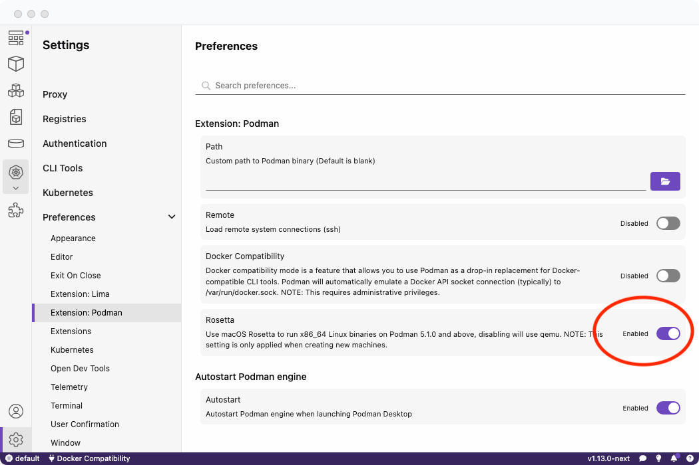

# Native Apple Rosetta translation layer

Virtual machine's created by Podman Machine use the native Apple hypervisor `applehv` with Rosetta enabled by default. This increases the speed of any `x86_64` builds or containers to near-native levels by using a translation layer.

For more information, refer to the [official Apple documentation](https://developer.apple.com/documentation/virtualization/running_intel_binaries_in_linux_vms_with_rosetta) regarding the Rosetta technology.

Rosetta support is **enabled by default** on all new Podman Machine installations. If you disable Rosetta, [qemu](https://www.qemu.org/) will instead be used.

#### Prerequisites

- macOS Silicon

#### Procedure

To enable Rosetta support, your Podman Machine instance must be re-created.

1. Delete your Podman Machine.

2. Enable Rosetta support under **Settings**:

3. Re-create your Podman Machine.

#### Verification

To verify that Rosetta has been enabled, check your `~/.config/containers/containers.conf` configuration.

If `rosetta = false` does _not_ exist, or is missing, Rosetta is already enabled by default.

You can also benchmark

#### Additional resources

- [Official Apple Rosetta documentation](https://developer.apple.com/documentation/virtualization/running_intel_binaries_in_linux_vms_with_rosetta)
